# GEMM optimization progress — from naive to near cuBLAS

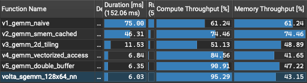

Profiling environment:
- Google Colab
- GPU: Nvidia Tesla T4, SM frequency 585 MHz (shared instance)
- Compute Capability: 7.5
- Computing GEMM as C = alpha · A · B + beta · C, where A, B, and C are all 2048 × 2048

Across five iterations — shared memory tiling, register tiling, vectorized memory access, and software-pipelined double buffering — the final kernel reaches 94.8% of cuBLAS's FP32 GEMM throughput on a Tesla T4, an 11.8× speedup over the naive baseline.

## Table of Contents
- [GEMM optimization progress — from naive to near cuBLAS](#gemm-optimization-progress--from-naive-to-near-cublas)
  - [Table of Contents](#table-of-contents)
  - [V1 — Naive Summation Over Col / Row Per Output Cell](#v1--naive-summation-over-col--row-per-output-cell)
    - [Interpretations](#interpretations)
    - [Potential improvements](#potential-improvements)
  - [V2 — Shared Memory Cached](#v2--shared-memory-cached)
    - [Interpretations](#interpretations-1)
    - [Potential improvements](#potential-improvements-1)
  - [V3 — 2D Register Tiling](#v3--2d-register-tiling)
    - [Optimizations](#optimizations)
    - [Interpretations](#interpretations-2)
    - [Potential improvements](#potential-improvements-2)
  - [V4 — Vectorized Memory Access](#v4--vectorized-memory-access)
    - [Optimizations](#optimizations-1)
    - [Interpretations](#interpretations-3)
    - [Potential improvements](#potential-improvements-3)
  - [V5 — Double Buffering (Software Pipelining)](#v5--double-buffering-software-pipelining)
    - [Optimizations](#optimizations-2)
    - [Interpretations](#interpretations-4)
    - [Further Improvements](#further-improvements)
  - [Summary: Progress Toward cuBLAS](#summary-progress-toward-cublas)
  - [Correctness](#correctness)

## V1 — Naive Summation Over Col / Row Per Output Cell

[v1_gemm_naive.cuh](v1_gemm_naive.cuh)

| FP32 peak [%] | Duration [ms] | % of cuBLAS performance [%] |
| - | - | - |
| 8 | 74.96 | 8.0 |

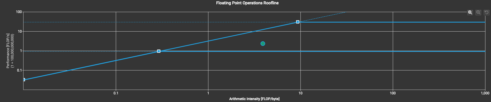
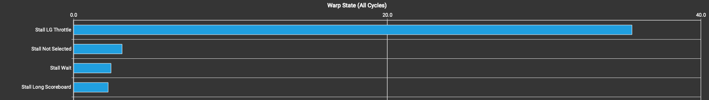

### Interpretations
- Each output element re-reads its full row of A and column of B from global memory, so global memory traffic dominates:
  1. Global memory access latency accumulates and is exposed on the critical path.
  2. The high volume of global loads congests the global memory pipeline, producing LG throttle stalls.
  3. There is too little arithmetic per load to hide the access latency behind other work.

### Potential improvements
- Reduce the frequency of global memory access, which both lowers exposed latency and relieves pressure on the global memory pipeline.
  - Apply shared memory tiling: load a tile of A and B from global memory into shared memory once, then let every thread in the block reuse those cached values — converting many redundant global loads into a few shared loads.

## V2 — Shared Memory Cached

[v2_gemm_smem_cached.cuh](v2_gemm_smem_cached.cuh)

| FP32 peak [%] | Duration [ms] | % of cuBLAS performance [%] |
| - | - | - |
| 12 | 46.30 | 13.0 |

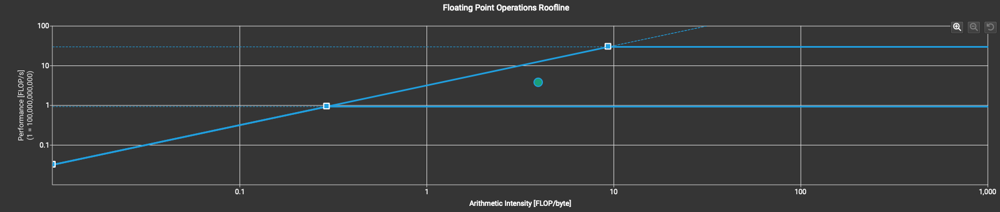
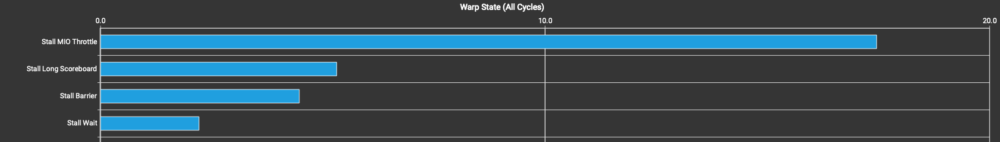

### Interpretations
- The bottleneck moves from global to shared memory: the tile now lives in shared memory, but it is accessed too frequently.
  1. Shared memory access latency accumulates on the critical path.
  2. The high volume of shared accesses congests the shared memory pipeline, producing MIO throttle stalls.
  3. There is still too little arithmetic per shared load to hide the access latency.
- The second most significant warp state is **Stall Long Scoreboard**, indicating that global load/store latency is still not fully hidden.

### Potential improvements
- Perform more FMA operations per shared load, so compute can hide the access latency.
- Reduce the number of shared memory loads to relieve pressure on the MIO pipeline.

## V3 — 2D Register Tiling

[v3_gemm_2d_tiling.cuh](v3_gemm_2d_tiling.cuh)

| FP32 peak [%] | Duration [ms] | % of cuBLAS performance [%] |
| - | - | - |
| 50 | 11.53 | 52.3 |

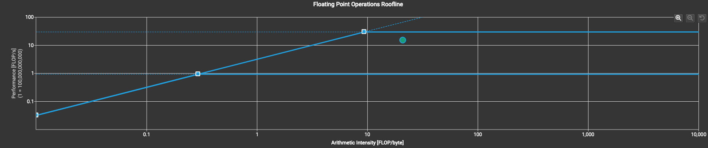
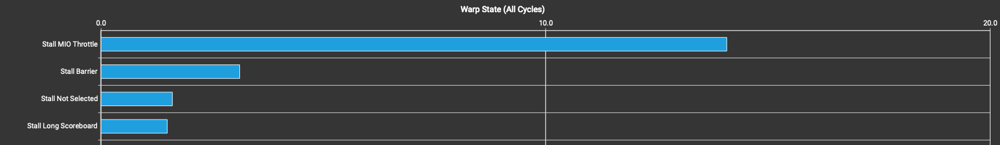

### Optimizations
  - Each thread now stages sub-tiles of A and B into registers and reuses them across a 2D block of output accumulators. This raises the amount of compute performed per shared load, which both hides latency and relieves pressure on the MIO unit.
  - Several hyperparameters affect performance. After a parameter sweep, the best configuration was: each thread computes a 4×4 output block, the tile size is 64×16, and the block uses 256 threads.

### Interpretations
  - This kernel still has unresolved memory access issues, including uncoalesced accesses and bank conflicts. Applying swizzling to remove the bank conflicts increased the live register count and lowered occupancy (see the proof of concept [here](pocs/poc_1_gemm_2d_tiling_conflict_free.cuh)), so the memory access optimization is deferred to a later version.

### Potential improvements
- The kernel is now compute-bound, so the goal shifts to approaching peak FP throughput. Two promising directions are (a) reducing stalls and (b) hiding remaining latency.
- Vectorized shared memory reads and writes are a good candidate for reducing the MIO throttle stalls.

## V4 — Vectorized Memory Access

[v4_gemm_vectorized_access.cuh](v4_gemm_vectorized_access.cuh)

| FP32 peak [%] | Duration [ms] | % of cuBLAS performance [%] |
| - | - | - |
| 84 | 6.84 | 88.2 |

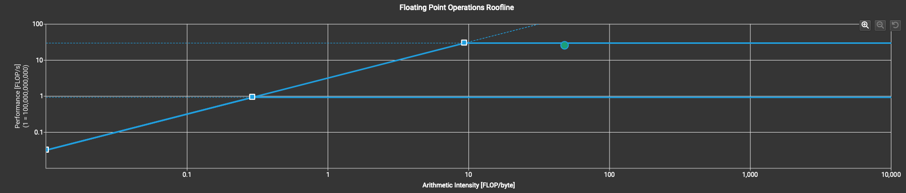
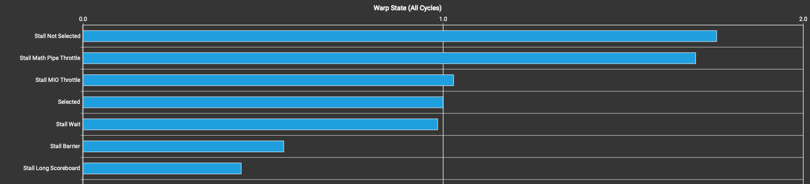

### Optimizations
  - Tile A is stored transposed in shared memory so its compute-time reads can be vectorized; this in turn requires swizzling to keep the accesses bank-conflict-free.
  - Each thread's output block is partitioned into 4×4 sub-blocks, enabling vectorized (128-bit) writes.
  - As in V3, the hyperparameters were tuned: each thread now computes an 8×8 output block, tile A is 64×16, tile B is 128×16, and the block uses 128 threads.
    - The asymmetric block shape (64×128) balances the number of global loads (LDG, for latency hiding) against the barrier stalls incurred within the block.

### Interpretations
  - Vectorization together with the tuned shared memory access pattern successfully mitigates the MIO throttle stalls.
  - With MIO throttle reduced, the dominant remaining stall is **Long Scoreboard**.

### Potential improvements
- To hide the Long Scoreboard latency, **double buffering** and **software pipelining** can overlap the next tile's global loads with the current tile's compute, improving **instruction-level parallelism**.

## V5 — Double Buffering (Software Pipelining)

[v5_gemm_double_buffer.cuh](v5_gemm_double_buffer.cuh)

| FP32 peak [%] | Duration [ms] | % of cuBLAS performance [%] |
| - | - | - |
| 90 | 6.35 | 94.8 |

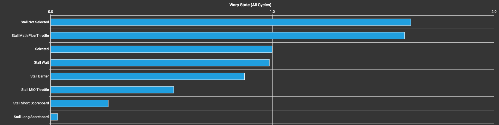

### Optimizations
 - The shared memory tile is double-buffered, so the next K-tile is prefetched while the current one is being consumed.
 - A **register staging buffer** holds the prefetched global data before it is written into the shared tile, decoupling the global load from the shared store.

### Interpretations
 - Double buffering successfully reduces the Long Scoreboard stalls, though the MIO throttle remains the limiting stall.

### Further Improvements
 - Investigate techniques to mitigate the remaining MIO throttle — in particular, eliminating the scalar shared-memory stores on the transposed A tile.

## Summary: Progress Toward cuBLAS

| Version | Duration [ms] | FP32 peak [%] | Speedup vs V1 | % of cuBLAS |
| - | - | - | - | - |
| V1 — Naive | 74.96 | 8% | 1.00× | 8.0% |
| V2 — Shared Memory | 46.30 | 12% | 1.62× | 13.0% |
| V3 — 2D Register Tiling | 11.53 | 50% | 6.50× | 52.3% |
| V4 — Vectorized Access | 6.84 | 84% | 10.96× | 88.2% |
| V5 — Double Buffering | 6.36 | 90% | 11.79× | 94.8% |
| **cuBLAS** (`volta_sgemm_128x64_nn`) | **6.03** | **95%** | **12.43×** | **100%** |

## Correctness
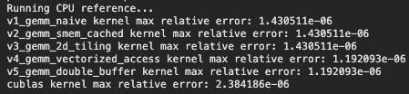