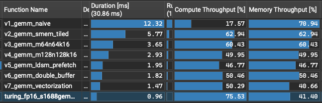
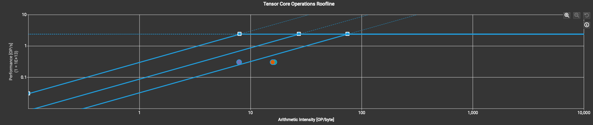
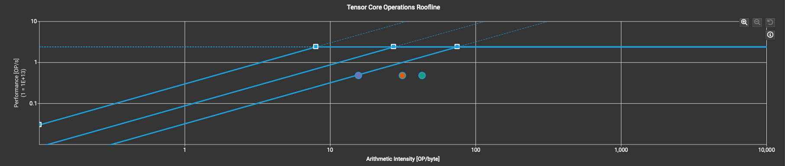
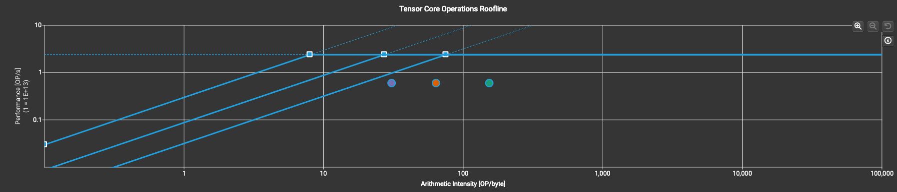
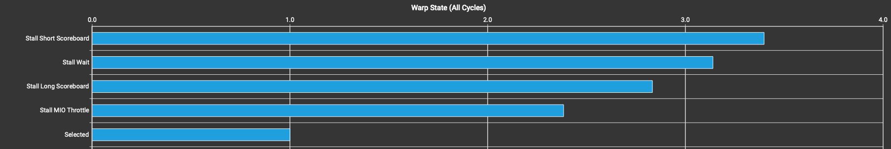
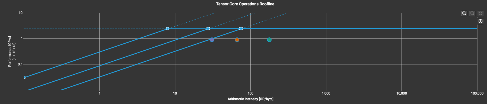
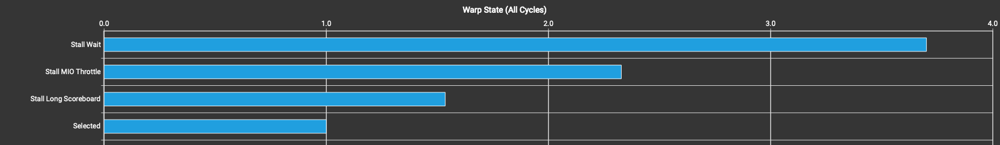
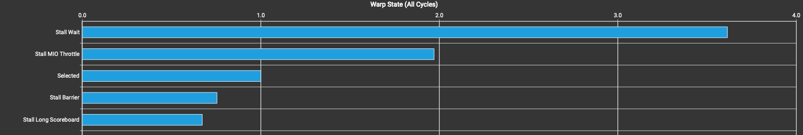
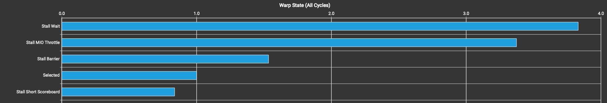
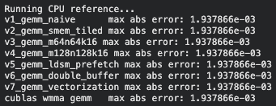

# WMMA GEMM optimization progress — tensor cores from naive to cuBLAS

Half-precision (fp16 in / fp32 accumulate) `C = alpha · A · B + beta · C` using the `nvcuda::wmma` tensor-core API, progressing from one warp computing a single 16×16 tile with no shared memory, up through warp-level tiling, hoisted fragment loads, software-pipelined double buffering, and vectorized global access.

Profiling environment:
- Google Colab
- GPU: Nvidia Tesla T4, SM frequency 585 MHz (shared instance)
- Compute Capability: 7.5
- Computing GEMM as C = alpha · A · B + beta · C, where A, B, and C are all 2048 × 2048

Across six iterations the final kernel reaches 64.6% of cuBLAS's fp16 tensor-op GEMM throughput on a Tesla T4, an 8.38× speedup over the naive baseline (12.32 ms → 1.47 ms).

## Progress Toward cuBLAS

| Version | Block Tile | Key Technique Added | Duration [ms] | Tensor Pipe Util. [%] | Speedup vs V1 | % of cuBLAS |
| - | - | - | - | - | - | - |
| V1 — Naive | 16×16 | — | 12.32 | 5.83 | 1.00× | 7.7% |
| V2 — Shared Memory Tiled | 32×32 | Shared-memory tile reuse | 5.77 | 12.43 | 2.14× | 16.5% |
| V3 — 64×64 Warp Tiling | 64×64 | 2×2 WMMA tiles per warp | 3.65 | 19.63 | 3.38× | 26.0% |
| V4 — 128×128 Warp Tiling | 128×128 | 4×4 WMMA tiles per warp | 2.93 | 24.56 | 4.22× | 32.5% |
| V5 — LDSM Prefetch | 128×128 | Hoisted fragment loads | 1.95 | 34.84 | 6.32× | 48.7% |
| V6 — Double Buffer | 128×128 | Software-pipelined global loads | 1.82 | 39.25 | 6.77× | 52.2% |
| V7 — Vectorization | 128×128 | `float4` global loads | 1.47 | 48.75 | 8.38× | 64.6% |
| **cuBLAS** (`cublasGemmEx`, tensor-op) | — | — | **0.96** | **74.86** | **12.97×** | **100%** |

> **% of cuBLAS** = (cuBLAS duration / kernel duration) × 100.
> Since GEMM has a fixed FLOP count, the throughput ratio equals the inverse duration ratio, so duration is used directly.
> **Speedup vs V1** = V1 duration / kernel duration.

## Table of Contents
- [WMMA GEMM optimization progress — tensor cores from naive to cuBLAS](#wmma-gemm-optimization-progress--tensor-cores-from-naive-to-cublas)
  - [Progress Toward cuBLAS](#progress-toward-cublas)
  - [Table of Contents](#table-of-contents)
  - [Shared Structure](#shared-structure)
  - [V1 — Naive, No Shared Memory](#v1--naive-no-shared-memory)
  - [V2–V4 — Shared Memory Tiling](#v2v4--shared-memory-tiling)
    - [Optimizations](#optimizations)
    - [Analysis](#analysis)
    - [Bottleneck \& next step](#bottleneck--next-step)
  - [V5 — Hoisted Fragment Loads (LDSM Prefetch)](#v5--hoisted-fragment-loads-ldsm-prefetch)
    - [Optimizations](#optimizations-1)
    - [Analysis](#analysis-1)
    - [Bottleneck \& next step](#bottleneck--next-step-1)
  - [V6 — Double Buffering (Software Pipelining)](#v6--double-buffering-software-pipelining)
    - [Optimizations](#optimizations-2)
    - [Analysis](#analysis-2)
    - [Bottleneck \& next step](#bottleneck--next-step-2)
  - [V7 — Vectorized Global Loads](#v7--vectorized-global-loads)
    - [Optimizations](#optimizations-3)
    - [Analysis](#analysis-3)
  - [Correctness check](#correctness-check)
  - [Future Improvements](#future-improvements)

## Shared Structure

Every kernel from V2 on is built from the same skeleton, so the version sections below
only describe what changed:

- **4 warps per block** (128 threads) arranged 2×2 (`WARP_DIM_X = WARP_DIM_Y = 2`).
- **K-step of 16**, matching the `16×16×16` WMMA fragment shape. Each iteration stages
  one A tile and one B tile into shared memory, syncs, issues `mma_sync`, and syncs again.
- Shared tiles are declared `tile_a[M_SMEM_ROWS][WMMA_M + 8]` and
  `tile_b[WMMA_N][N_SMEM_COLS + 8]` — the **+8 halves of padding** shifts each row across
  bank boundaries so `load_matrix_sync` doesn't hit bank conflicts.
- The block tile is a pure function of how many WMMA tiles each warp owns:
  `M_SMEM_ROWS = WARP_DIM_Y · 16 · M_TILES`, `N_SMEM_COLS = WARP_DIM_X · 16 · N_TILES`.
- **No bounds checking** past V2, so M, N, K must be exact multiples of the block tile —
  16 for V1, 32 for V2, 64 for V3, 128 for V4–V7.
- The epilogue loads the existing C tile into a `half` accumulator fragment, applies
  `alpha · acc + beta · C` element-wise over `c_frag.x[]`, and stores it back. (V2 is the
  exception: it routes the result through a `float` `scratch` buffer in shared memory.)

## V1 — Naive, No Shared Memory

[v1_gemm_naive.cuh](v1_gemm_naive.cuh)

One warp per block, each block computing a single 16×16 output tile.
`wmma::load_matrix_sync` reads the A and B fragments **straight from global memory** on
every `k` step — no shared memory, no reuse across warps.

| Tensor Pipe Util. [%] | Arithmetic Intensity [OP/byte] | Main Warp State | Duration [ms] | % of cuBLAS |
| - | - | - | - | - |
| 5.83 | 6.12 | LG Throttle | 12.32 | 7.7% |

At 6.12 OP/byte the kernel sits far left of the 75 OP/byte ridge point — memory-bound,
with LG Throttle confirming the global pipeline is the constraint. The fix is the same
one the FP32 project starts with: stage A/B tiles through shared memory so all warps in
a block share one set of global loads.

> The naive → shared-memory reasoning is identical to the FP32 version and is worked
> through in detail there — see [`../gemm/README.md`](../gemm/README.md), V1 and V2. This
> report picks the argument back up where the tensor-core-specific work begins.

## V2–V4 — Shared Memory Tiling

[v2_gemm_smem_tiled.cuh](v2_gemm_smem_tiled.cuh) ·
[v3_gemm_m64n64k16.cuh](v3_gemm_m64n64k16.cuh) ·
[v4_gemm_m128n128k16.cuh](v4_gemm_m128n128k16.cuh)

These three are **the same kernel at three tile sizes**. V2 introduces shared-memory
staging; V3 and V4 change only `M_TILES`/`N_TILES`, which widens the block tile and the
per-warp accumulator array. They are grouped here because the interesting result is the
trend across them, not any individual kernel.

### Optimizations
- **V2** stages A and B through shared memory once per `k`-step, reused by all 4 warps.
  Each warp owns one 16×16 WMMA tile inside a 32×32 block tile.
- **V3 / V4** give each warp an `M_TILES × N_TILES` grid of accumulator fragments
  (`acc_frag[M_TILES * N_TILES]`, all held in registers for the whole K loop) instead of
  a single one. This is the tensor-core analogue of register tiling: one shared-memory
  tile now feeds `M_TILES × N_TILES` `mma_sync` calls rather than one.

| Version | WMMA Tiles/Warp | Tensor Pipe Util. [%] | Arithmetic Intensity [OP/byte] | Main Warp State | Duration [ms] | % of cuBLAS |
| - | - | - | - | - | - | - |
| V2 | 1×1 | 12.43 | 16.48 | MIO Throttle | 5.77 | 16.5% |
| V3 | 2×2 | 19.63 | 43.04 | MIO Throttle | 3.65 | 26.0% |
| V4 | 4×4 | 24.56 | 156.74 | Short Scoreboard | 2.93 | 32.5% |

### Analysis
- Arithmetic intensity is what the tile size actually buys: **16.48 → 43.04 → 156.74
  OP/byte**. V2 and V3 are still left of the 75 OP/byte ridge point and therefore
  memory-bound; **V4 is the first kernel to cross it and become compute-bound.**
- Tensor pipe utilization climbs (12.43 → 24.56%) but stays low, so crossing the ridge
  point did *not* mean the tensor cores were busy — the bottleneck moved rather than
  disappeared.
- Occupancy pays for it: active warps per scheduler fall from 7.82 to 1.92, because each
  warp now holds 16 accumulator fragments plus its shared tiles.

### Bottleneck & next step
- Scaling the tile further would keep trading occupancy away, so the next win has to come
  from removing work instead. V4's inner double loop reloads `a_frag[i]` and `b_frag[j]`
  from shared memory for **every** `(i, j)` pair, even though each fragment is reused
  across a whole row/column of the 4×4 grid — 32 `load_matrix_sync` calls where 8 would do.

## V5 — Hoisted Fragment Loads (LDSM Prefetch)

[v5_gemm_ldsm_prefetch.cuh](v5_gemm_ldsm_prefetch.cuh)

### Optimizations
- `a_frag[M_TILES]` and `b_frag[N_TILES]` are declared as arrays and loaded **once per
  `k`-step**, before the `(i, j)` loop. The inner loop then does nothing but `mma_sync`,
  reading fragments already in registers.
- For the 4×4 configuration this cuts shared-memory fragment loads per `k`-step from 32
  to 8 — a 4× reduction — at the cost of holding 8 input fragments live alongside the 16
  accumulators.

| Tensor Pipe Util. [%] | Arithmetic Intensity [OP/byte] | Main Warp State | Duration [ms] | % of cuBLAS |
| - | - | - | - | - |
| 34.84 | 177.99 | Wait / MIO Throttle | 1.95 | 48.7% |

### Analysis
- The largest single jump in the series: 2.92 → 1.95 ms (1.50×), and tensor pipe
  utilization rises from 24.56% to 34.84%.
- The dominant warp state becomes **Wait**, with MIO Throttle behind it.

### Bottleneck & next step
- With the shared-memory reads thinned out, the exposed cost is the global load at the
  top of every `k`-step: the whole block stalls at `__syncthreads()` while the next tile
  arrives, and with only 1.92 active warps per scheduler there is no other warp to run
  meanwhile. Overlap that transfer with the current tile's compute — **double buffering**.

## V6 — Double Buffering (Software Pipelining)

[v6_gemm_double_buffer.cuh](v6_gemm_double_buffer.cuh)

### Optimizations
- `tile_a` and `tile_b` become two-stage buffers (`[2][...]`), selected by `g_tile_id`,
  which flips each iteration.
- The first tile is loaded before the K loop. Inside the loop, the *next* `k`-tile is read
  from global memory into per-thread **register staging buffers** (`stage_a`/`stage_b`)
  *before* the `mma_sync` work on the current buffer, then written into the alternate
  shared buffer afterwards.
- Splitting the global load from the shared store is what makes the overlap real: the
  `LDG` is issued early and only its consumer — the shared store — waits on it, so the
  tensor-core work in between proceeds while the data is in flight.

| Tensor Pipe Util. [%] | Arithmetic Intensity [OP/byte] | Main Warp State | Duration [ms] | % of cuBLAS |
| - | - | - | - | - |
| 39.25 | 173.54 | Wait / MIO Throttle | 1.82 | 52.2% |

### Analysis
- Compute throughput recovers (44.65 → 50.30%) and tensor pipe utilization reaches
  39.25%, but the overall gain is modest: 1.95 → 1.82 ms.
- Both stall categories persist. The pipeline now hides global *latency*, but each thread
  still moves one `half` per transaction, so the sheer instruction count of the staging
  loops remains — that is the MIO pressure double buffering cannot remove.

### Bottleneck & next step
- Make each of those transactions wider. One `half` per thread per load wastes most of the
  128-bit path a memory instruction can drive.

## V7 — Vectorized Global Loads

[v7_gemm_vectorization.cuh](v7_gemm_vectorization.cuh)

### Optimizations
- Same double-buffered pipeline as V6, but every global read and shared write moves
  **128 bits — 8 `half`s — at a time** via the `FLOAT4`/`CFLOAT4` reinterpret-cast macros,
  for both the pre-loop load and the in-loop prefetch.
- The thread mapping is rescaled to match (`a_dim_x = WMMA_M / 8`,
  `b_dim_x = N_SMEM_COLS / 8`), so the same 128 threads cover each tile in one eighth the
  instructions.

| Tensor Pipe Util. [%] | Arithmetic Intensity [OP/byte] | Main Warp State | Duration [ms] | % of cuBLAS |
| - | - | - | - | - |
| 48.75 | 155.11 | Wait / MIO Throttle | 1.47 | 64.6% |

### Analysis
- This is the first version where compute and memory throughput **separate**: 50.39% vs
  40.74%. Every version from V2 through V6 reported the two within a point of each other
  (62.93/62.93, 60.44/60.44, 49.90/49.90, 44.65/44.65, 50.30/50.30) — memory is no longer
  the co-equal limiter.
- Tensor pipe utilization reaches 48.75%, the best in the series, and duration drops to
  1.47 ms — 64.6% of cuBLAS.
- Remaining gap to cuBLAS (74.86% tensor pipe utilization): the padding that keeps
  `load_matrix_sync` conflict-free now misaligns the `float4` accesses, so the vectorized
  loads pay bank conflicts of their own. See Future Improvements.

## Correctness check

## Future Improvements
- `load_matrix_sync` currently issues `LDSM.16.M88.2` instead of `LDSM.16.M88.4`, doubling
  the instruction count. Using `ldmatrix` combined with `mma.sync` directly could load 4
  tiles in a single instruction instead.
- To avoid the bank conflicts introduced by `load_matrix_sync`, shared memory is padded —
  but that padding causes bank conflicts on the vectorized loads instead. Combining the
  `ldmatrix` + `mma.sync` approach above with **swizzling** may avoid both.
