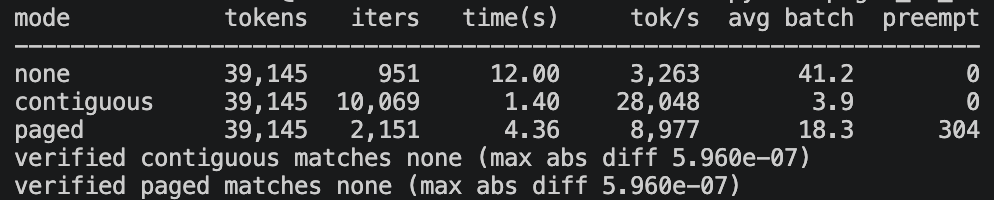

# KV Cache Practice (cacheless / contiguous / paged)

## Overview

To compare benchmark statistics across different KV cache strategies, I implemented a
simple scheduler supporting continuous batching and preemption (recomputation-based)
for the paged cache.

Before benchmarking, a set of requests is generated. Each request contains a prompt
(Tensor), `max_decode_tokens` (used for reservation in contiguous mode), and
`done_len`, a target length that simulates EOS detection.

Note on scope: this is a *mechanism* simulator, not a model runner. Prompts are random
tensors passed through a single attention layer, so the outputs are not language. The
goal is to measure how cache layout affects scheduling, batch size, and memory
utilization.

The PagedAttention paper notes that load/store should be handled by a fused kernel for
good performance on non-contiguous blocks. Here I use tensor indexing and concatenation
instead, which is simpler but leaves a known performance gap.

## Metrics

- **Mode** — cache strategy (`none` = cacheless, recompute every step)
- **Tokens** — total tokens generated; used as a coarse correctness check alongside
  the element-wise verification in `verify_consistency`
- **Iters** — total scheduler iterations until all requests complete
- **Time(s)** — total elapsed time
- **Tok/s** — generated tokens per second
- **Avg batch** — mean number of sequences running per iteration
- **Preempt** — number of preemptions (paged only)

## Benchmark

Benchmark settings:

- Model dimension: 256 (single attention head)
- Requests: 100
- KV budget: 5120 tokens (total across all sequences)
- Terminate length: random, 200–600 tokens per request
- Contiguous mode: preallocates `prompt_len + 1024` tokens per sequence
- Paged mode: block size 32 tokens (160 blocks total)

**Cacheless** has the fewest iterations and the largest average batch, since it holds
no cache and therefore has no memory limit on admission. But it recomputes K/V for the
entire history at every decode step, so it has by far the highest total runtime.

**Contiguous** is the fastest overall. The cache eliminates recomputation, and each
sequence's K/V is one contiguous slice, so gathering is free. Its weakness is
admission: it must reserve `prompt_len + max_decode_tokens` up front, so the token
budget admits far fewer concurrent sequences — hence the low average batch.

**Paged** sustains a larger batch than contiguous at the same memory budget, because
blocks are allocated on demand instead of reserved for the worst case. In this
implementation it is still slower than contiguous, because every attention call
gathers the sequence's blocks via fancy indexing, which copies. A fused paged-attention
kernel that reads blocks in place would remove this cost; that is outside the scope
here.

## Correctness

All three modes are verified element-wise against the cacheless baseline
(`verify_consistency`). Cacheless recomputes from scratch each step while the cached
modes compute each K/V once and reuse it, so results differ only by float32 rounding
(~5e-07 observed).