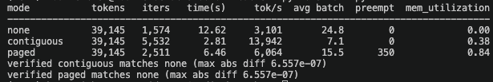

# KV Cache Practice (cacheless / contiguous / paged)

## Overview

To compare benchmark statistics across different KV cache strategies, I implemented a
simple scheduler supporting continuous batching and preemption (recomputation-based)
for the paged cache.

Before benchmarking, a set of requests is generated. Each request contains a prompt
(Tensor), `max_decode_tokens` (used for reservation in contiguous mode), and
`terminal_len`, a target length that simulates EOS detection.

Note on scope: this is a *mechanism* simulator, not a model runner. Prompts are random
tensors passed through a single attention layer with random generated weights, so the outputs are not language. The
goal is to measure how cache layout affects scheduling, batch size, and memory
utilization.

The PagedAttention paper notes that load/store should be handled by a fused kernel for
good performance on non-contiguous blocks. Here I use tensor indexing and concatenation
instead, which is simpler but leaves a known performance gap.

## Structure

| File | Contents |
| --- | --- |
| `RequestQueue.py` | `Request` (`prompt`, `max_decode_tokens`, `terminal_len`) and a bounded FIFO `RequestQueue` with `requeue` to push back at the head |
| `ContiguousKVCache.py` | `ContiguousCachePool` and `ContiguousKVCache` (one sequence's reserved slice) |
| `PagedKVCache.py` | `PagedCachePool` (the page store) and `PagedKVCache` (one sequence's page table) |
| `ContinuousBatchScheduler.py` | `AttentionLayer`, `Sequence`, and the `ContinuousBatchScheduler` driving loop |
| `main.py` | request generation, the benchmark sweep, `verify_consistency`, and result printing |

Every pool exposes `capacity`; every per-sequence cache exposes `append(k, v)`,
`release()`, `.keys`, `.values`, and `.length`. The scheduler is written against that
shared surface, so `mode` only decides which pool (if any) gets constructed — the
prefill/decode/retire logic is identical across modes.

## Modes

**Cacheless (`none`)** has no pool at all. `Sequence.cache` is `None`, so every decode
step re-projects `concat(prompt, generated)` and runs full attention over it, keeping
only the last row. Nothing is stored between steps, so admission is never blocked by
memory — but the per-step cost grows with sequence length.

**Contiguous** — `ContiguousCachePool` owns one `(max_size, dim)` K and V tensor and
tracks *occupied* intervals in a `SortedDict` keyed by start offset (plus a sentinel
entry at `max_size` that bounds the scan). `alloc(size)` walks the intervals in
increasing order and returns the first gap large enough — first-fit — or raises if none
exists. A `ContiguousKVCache` reserves `max_decode_tokens` slots at construction and
never grows; `append` writes into its slice and `.keys`/`.values` are plain views, so
attention reads the pool with zero copying. The cost is that the reservation is sized
for the worst case the sequence could reach, not what it actually uses.

**Paged** — `PagedCachePool` owns `(num_pages, page_size, dim)` K and V tensors and a
free list of page ids; `alloc()` pops one page, `release()` returns a list of them. A
`PagedKVCache` holds `_page_ids`, its page table. `append` pulls a new page only when
`length` crosses a page boundary. Memory is therefore committed in
`page_size` increments as the sequence actually grows. The price is on the read path:
`.keys`/`.values` do `pool.k[_page_ids].reshape(-1, dim)[:length]`, and that fancy
index **copies**, because the pages are not contiguous. A fused paged-attention kernel
would read the pages in place instead.

## Scheduler workflow

`ContinuousBatchScheduler.run` holds a batch of live `Sequence`s and loops until the
queues and the batch are all empty. Each iteration:

1. **Admit** — fill the batch up to `max_batch` is possible. Requests come from `preempt_queue`
   first (paged only) and otherwise from the main queue, so a preempted request wins
   over a never-started one. `_try_add_request` attempts the cache allocation; if the
   pool is exhausted it returns `None`, the request is pushed back at the head, and
   admission stops for this iteration.
2. **Prefill** — each newly admitted sequence immediately runs causal attention over
   its prompt, seeds its cache with the prompt K/V, and emits its first token.
3. **Decode** — every live sequence projects only its last token, appends that one K/V
   to its cache, and attends over the whole cache. For cacheless mode it projects
   prompt and generated tokens every step.
4. **Preempt** — if `append` raises because the pool ran dry, the *last* sequence in
   the batch is chosen as the victim: its memory is released, its prompt is rewritten
   to `prompt + all generated tokens`, its remaining budget is reduced by the tokens
   already emitted, and it goes onto `preempt_queue` to be re-prefilled later. The
   blocked sequence then retries its decode. The victim may be the blocked sequence
   itself, in which case it just yields for this iteration.
5. **Retire** — sequences that reached `terminal_len` (or filled a contiguous
   reservation) release their memory and leave the batch.

Preemption is recompute-based, so nothing is swapped out: the released pages are reused
immediately and the victim rebuilds its cache from scratch on re-admission. That is why
the whole generated prefix has to go back into the prompt — restoring only the last
token would rebuild a cache missing everything in between.

## Metrics

- **Mode** — cache strategy (`none` = cacheless, recompute every step)
- **Tokens** — total tokens generated, counting the token each prefill emits; used as a
  coarse correctness check alongside the element-wise `verify_consistency`. All modes
  must land on `sum(terminal_len)` regardless of how often they preempt
- **Iters** — total scheduler iterations until all requests complete
- **Time(s)** — total elapsed time
- **Tok/s** — generated tokens per second
- **Avg batch** — mean number of sequences running per iteration
- **Preempt** — number of preemptions (paged only)
- **Mem utilization** — live cached tokens over pool capacity, averaged per iteration;
  the gap between contiguous and paged is the reservation waste

## Benchmark

Benchmark settings:

- Model dimension: 256 (single attention head)
- Requests: 100
- KV budget: `budget_tokens` (total across all sequences)
- Terminate length: random, 200–600 tokens per request
- Contiguous mode: reserves `max_decode_tokens` per sequence, rounded up to a multiple
  of 32 above `prompt_len + done_len`
- Paged mode: page size 32 tokens, `budget_tokens // 32` pages

**Cacheless** has the fewest iterations and the largest average batch, since it holds
no cache and therefore has no memory limit on admission. But it recomputes K/V for the
entire history at every decode step, so it has by far the highest total runtime.

**Contiguous** is the fastest overall. The cache eliminates recomputation, and each
sequence's K/V is one contiguous slice, so gathering is free. Its weakness is
admission: it must reserve for the worst case up front, so the token budget admits far
fewer concurrent sequences — hence the low average batch and low memory utilization.

**Paged** sustains a larger batch than contiguous at the same memory budget, because
pages are allocated on demand instead of reserved for the worst case. In this
implementation it is still slower than contiguous, because every attention call
gathers the sequence's pages via fancy indexing, which copies. A fused paged-attention
kernel that reads pages in place would remove this cost; that is outside the scope
here.

## Correctness

All three modes are verified element-wise against the cacheless baseline
(`verify_consistency`). Cacheless recomputes from scratch each step while the cached
modes compute each K/V once and reuse it, so results differ only by float32 rounding
(~7e-07 observed) — including for requests that were preempted and rebuilt mid-flight.
